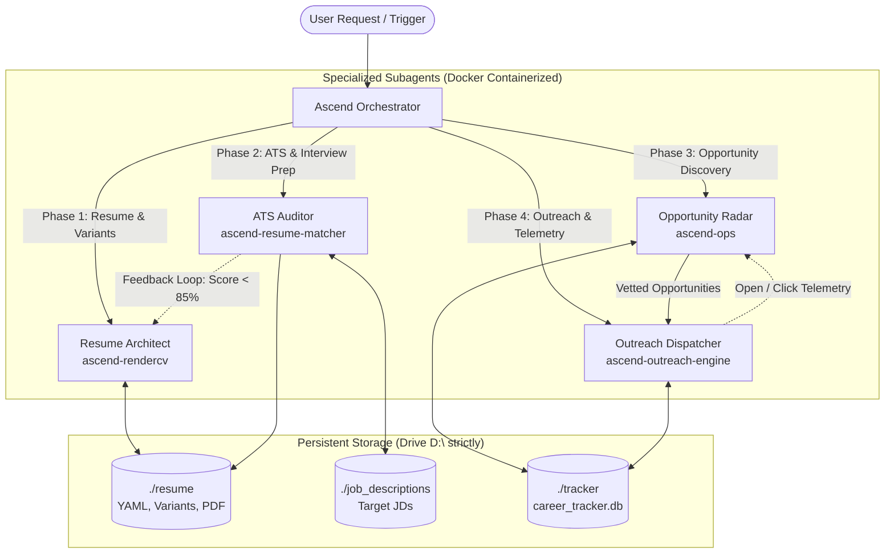

# Ascend: Multi-Agent Architecture & Operating Manual (`AGENTS.md`)
## The Autonomous SWE Career Acceleration Engine (5-Agent Ecosystem)

This document outlines the specialized subagent hierarchy, operational boundaries, communication protocols, telemetry mechanisms, and execution rules for **Ascend**, the containerized SWE career acceleration engine.

---

## 1. Core Operating Principles & Hard Constraints

Every subagent operating within this ecosystem MUST strictly adhere to the following rules:

1. **Host Isolation:** Zero dependencies installed directly on the Windows host. All tool execution, compilation, scraping, database transactions, email dispatching, and tracking operations MUST run inside containerized Docker environments managed via `docker-compose.yml`.
2. **Drive & Volume Confinement:** All persistent data, state, configurations, reports, and volume bind mounts MUST reside strictly on drive `D:\` under `D:\Projects\career-system\` (or workspace junction `d:\Projects\carrer-system\`). **NEVER write, mount, or persist data to `C:\`**.
3. **100% Free-Tier Tooling:** Exclusive usage of open-source containers, local LLM backends (Ollama with `llama3.2`), Google Gemini Free Tier APIs (`gemini-3.8-flash`), and native Python SMTP. Zero paid third-party subscriptions.
4. **Deterministic Metrics:** Every resume accomplishment bullet MUST strictly follow the Google X-Y-Z Formula (*"Accomplished [X], as measured by [Y], by doing [Z]"*).
5. **Anti-Spam & Delivery Safeguards:** Cold outreach respects strict daily volume caps (max 15/day), rate-limits, and dry-run safety modes to preserve candidate domain reputation.

---

## 2. Specialized 5-Subagent Architecture



---

## 3. Upstream Open-Source Foundations

The system embeds the full, pristine source code of top open-source career automation projects in their respective `upstream/` directories:

| Service Directory | Upstream Repository | Upstream Engine Domain | Stars / Track Record |
| :--- | :--- | :--- | :--- |
| `services/rendercv/upstream/` | [`rendercv/rendercv`](https://github.com/rendercv/rendercv) | Typst/LaTeX vector engine, schema-validated templates (`sb2nov`, `engineeringresumes`, `classic`), YAML/JSON data models. | 3,000+ stars |
| `services/resume-matcher/upstream/` | [`srbhr/Resume-Matcher`](https://github.com/srbhr/Resume-Matcher) | Machine learning ATS parser, vector keyword extraction, NLP semantic similarity, Qdrant/FastAPI backend. | 27,000+ stars |
| `services/career-ops/upstream/` | [`santifer/career-ops`](https://github.com/santifer/career-ops) | AI-powered job search engine, Greenhouse/Ashby/Lever scrapers, application answer generator, recruiter lookup, funding radar. | Tested across 740+ offers |

---


### Agent 1: `resume-architect` (Resume Builder, Typographer & Pitch Stylist)
- **Primary Domain:** LaTeX/Typst resume engineering, typography, dynamic JD variant tailoring, and executive cover letters.
- **Service Container:** `career-rendercv`
- **Volume Mount:** `D:\Projects\career-system\resume:/work`
- **Responsibilities:**
  1. Maintain master resume (`resume/master_resume.yaml`) using the **`sb2nov`** (Jake's Resume classic) theme.
  2. Enforce the **Google X-Y-Z Formula** (*Accomplished [X], as measured by [Y], by doing [Z]*) on every bullet point.
  3. Ensure heavy engineering emphasis: high throughput (QPS/RPS), p99 latency reduction, distributed caching, database indexing, zero-downtime migrations, and cloud infrastructure cost optimization.
  4. Generate dynamic company-tailored resume variants (`resume/variants/<company>_<role>.yaml`) prioritizing matching tech stacks for Tier-1 applications.
  5. Architect 1-page executive pitch memos and cover letters in matching `sb2nov` LaTeX typography.
  6. Compile vector ATS PDFs, high-res preview PNGs, and plain-text ATS copy-paste blocks via Docker.
- **Command Interface:**
  ```powershell
  docker compose run --rm rendercv render master_resume.yaml
  ```
- **Inputs & Outputs:**
  - *Input:* `resume/master_resume.yaml`, `resume/variants/*.yaml`
  - *Output:* `resume/rendercv_output/candidate_cv.pdf`, `resume/rendercv_output/*.png`

---

### Agent 2: `ats-auditor` (ATS Bar-Raiser & Interview Prep Engine)
- **Primary Domain:** ATS parsing simulation, keyword taxonomy, LLM semantic alignment, and technical interview defense prep.
- **Service Container:** `career-resume-matcher`
- **Volume Mounts:**
  - Resumes: `D:\Projects\career-system\resume:/app/data/resumes`
  - Target JDs: `D:\Projects\career-system\job_descriptions:/app/data/jobs`
  - Reports: `D:\Projects\career-system\resume/reports:/app/data/reports`
- **Responsibilities:**
  1. Ingest generated resumes (YAML / PDF) and compare against target Tier-1 SWE job descriptions in `job_descriptions/`.
  2. Compute **Keyword Coverage & Hard Skills Match** against systems engineering terminology.
  3. Verify **Google X-Y-Z Metric Density** (active verbs, quantifiable numbers/percentages, technical mechanisms).
  4. Call the free LLM backend (Google Gemini Free Tier `gemini-3.8-flash` or local Ollama `llama3.2`) for semantic gap analysis and seniority fit evaluation.
  5. Enforce the **85%+ ATS Compatibility Benchmark**. If any JD scores $< 85\%$, generate concrete line-by-line revision instructions for `resume-architect`.
  6. **Technical Interview Defense Generator:** Automatically compile `interview_defense_prep.md` detailing STAR narratives and high-probability system design failure modes (network partitions, consumer group rebalancing, exact-once semantics).
- **Command Interface:**
  ```powershell
  docker compose run --rm resume-matcher
  ```
- **Inputs & Outputs:**
  - *Input:* `resume/master_resume.yaml`, `job_descriptions/*.md`
  - *Output:* `resume/reports/ats_audit_report.md`, `resume/reports/interview_defense_prep.md`

---

### Agent 3: `market-scout` (High-Comp Opportunity Pipeline & Decision-Maker Discovery)
- **Primary Domain:** Market intelligence, job board API scraping, compensation filtering, recruiter lookup, and application CRM.
- **Service Container:** `career-ops`
- **Volume Mount:** `D:\Projects\career-system\tracker:/app/data`
- **Responsibilities:**
  1. Poll public ATS and company endpoints (Greenhouse, Ashby, Lever, Levels.fyi, and YC Work at a Startup feeds).
  2. Filter strictly for high-compensation opportunities ($130,000 to $350,000+ base) and senior engineering tracks.
  3. Apply strict **SWE Role Verification** (filtering out non-engineering roles like sales, recruiting, and product management).
  4. Execute the **1–5 Engineering Fit Scoring Rubric**:
     - **Score 5 (4.5–5.0):** Tier-1 Tech / Top YC, Comp $\ge \$180\text{k}$, Distributed Systems focus, Tech match $\ge 85\%$.
     - **Score 4 (3.8–4.4):** High-growth modern tech, Comp $\$140\text{k}–\$180\text{k}$, solid tech stack match.
     - **Score 3 (3.0–3.7):** Standard mid-market SWE role ($\$120\text{k}–\$140\text{k}$).
     - **Score 2 / 1 (<3.0):** Low-signal or filtered out.
  5. **Decision-Maker Discovery:** Generate targeted search patterns to identify Engineering Managers, Heads of Engineering, and Technical Recruiters.
  6. **Application Lifecycle CRM:** Track applications across structured stages: `IDENTIFIED` $\rightarrow$ `TAILORED` $\rightarrow$ `APPLIED` $\rightarrow$ `OUTREACH_SENT` $\rightarrow$ `INTERVIEWING` $\rightarrow$ `OFFER` $\rightarrow$ `REJECTED`.
  7. Store all vetted opportunities in a persistent SQLite database (`tracker/career_tracker.db`) with memory-journal optimization for Windows Docker mounts.
  8. Generate the Markdown opportunity leaderboard in `tracker/reports/top_opportunities.md`.
- **Command Interface:**
  ```powershell
  docker compose run --rm career-ops
  ```
- **Inputs & Outputs:**
  - *Input:* `services/career-ops/config.yaml`, Greenhouse/Ashby/Lever APIs
  - *Output:* `tracker/career_tracker.db`, `tracker/reports/top_opportunities.md`

---

### Agent 4: `outreach-dispatcher` (Cold Email, LinkedIn & Telemetry Engine)
- **Primary Domain:** Cold outreach composition, email delivery, LinkedIn connection drafting, tracking pixel telemetry, and follow-up sequences.
- **Service Container:** `career-outreach-engine`
- **Port:** `8085` (Local tracking server)
- **Volume Mounts:**
  - `D:\Projects\career-system\tracker:/app/data`
  - `D:\Projects\career-system\resume:/app/resume`
- **Responsibilities:**
  1. **Cold Email Generation:** Use `gemini-3.8-flash` to craft 3-paragraph executive cold emails referencing target engineering scale and candidate's quantifiable metrics (e.g. large-scale database migrations, 30k+ QPS pipelines, anomaly detection engines, autonomous AI agent platforms).
  2. **Email Delivery & SMTP Support:** Send emails via Python's native `smtplib` using free Gmail App Passwords (`smtp.gmail.com:587`) or free-tier Resend API with zero paid subscriptions.
  3. **Open & Click Telemetry:**
     - Inject 1x1 transparent tracking pixel: `GET /t/o/{tracking_id}`
     - Wrap links with redirect tracker: `GET /t/c/{tracking_id}?url=...`
     - Record open timestamps, user agents, and click counts in `career_tracker.db`.
  4. **LinkedIn Outreach Sequencing:** Generate punchy 280-character connection request notes and InMail conversation starters.
  5. **Cadence State Machine:** Automatically schedule Day 3, Day 7, and Day 14 follow-up reminders.
- **Command Interface:**
  ```powershell
  # Generate personalized outreach & schedule follow-ups
  docker compose run --rm outreach-engine

  # Start telemetry tracking server
  docker compose up -d outreach-engine
  ```
- **Inputs & Outputs:**
  - *Input:* `tracker/career_tracker.db`, candidate profile
  - *Output:* `tracker/reports/outreach_pipeline.md`, live telemetry on port 8085

---

### Agent 5: `system-orchestrator` (Lifecycle & Protocol Manager)
- **Primary Domain:** Multi-service coordination, environment health verification, volume integrity, and iterative convergence.
- **Responsibilities:**
  1. **Phase 0 Execution:** Verify Docker status, clean lingering containers (`docker system prune -f`), and verify drive `D:\` junction.
  2. **Pipeline Sequencing:** Direct execution sequence: **Phase 0 $\rightarrow$ Phase 1 $\rightarrow$ Phase 2 $\rightarrow$ Phase 3 $\rightarrow$ Phase 4**.
  3. **Feedback Loop Convergence:** If `ats-auditor` detects an ATS score $< 85\%$, dispatch `resume-architect` with the audit diffs until the benchmark is satisfied.
  4. **Safety & Quarantine:** Ensure no scripts attempt host-level `pip install`, `npm install`, or writes to `C:\`.

---

## 3. Subagent Collaboration Matrix

| Event / Trigger | Active Agent | Collaborating Agent | Artifact Hand-Off |
| :--- | :--- | :--- | :--- |
| **New Experience Ingestion** | `system-orchestrator` | `resume-architect` | Raw notes $\rightarrow$ `resume/master_resume.yaml` |
| **Resume Compilation** | `resume-architect` | `ats-auditor` | `rendercv_output/*.pdf` $\rightarrow$ Evaluator |
| **ATS Score < 85%** | `ats-auditor` | `resume-architect` | `ats_audit_report.md` $\rightarrow$ YAML Refactor |
| **Interview Prep Request** | `ats-auditor` | `system-orchestrator` | Target JDs $\rightarrow$ `interview_defense_prep.md` |
| **Market Scan Trigger** | `market-scout` | `system-orchestrator` | `career_tracker.db` $\rightarrow$ `top_opportunities.md` |
| **Outreach Batch Trigger** | `outreach-dispatcher` | `market-scout` | Top jobs $\ge 4.4 \rightarrow$ `outreach_pipeline.md` |
| **Recruiter Clicks Link** | `outreach-dispatcher` | `system-orchestrator` | Open/Click Telemetry $\rightarrow$ `career_tracker.db` |

---

## 4. Subagent Command Playbook

```powershell
# ==========================================================
# 1. ORCHESTRATOR HEALTH CHECK & CLEANUP
# ==========================================================
docker compose config
docker system prune -f

# ==========================================================
# 2. RESUME-ARCHITECT: COMPILE MASTER RESUME
# ==========================================================
docker compose run --rm rendercv render master_resume.yaml

# ==========================================================
# 3. ATS-AUDITOR: EXECUTE ATS AUDIT & INTERVIEW DEFENSE
# ==========================================================
docker compose run --rm resume-matcher

# ==========================================================
# 4. MARKET-SCOUT: SCAN HIGH-COMP JOBS & UPDATE CRM
# ==========================================================
docker compose run --rm career-ops

# ==========================================================
# 5. OUTREACH-DISPATCHER: GENERATE EMAIL/LINKEDIN SEQUENCES
# ==========================================================
docker compose run --rm outreach-engine

# ==========================================================
# 6. START TRACKING TELEMETRY SERVER (Background Daemon)
# ==========================================================
docker compose up -d outreach-engine
curl http://localhost:8085/api/stats
```

---

## 5. Configuration & Environment Variables (`.env`)

```ini
# LLM Backend (Free Tier Google Gemini)
GEMINI_API_KEY=your_free_gemini_api_key
GEMINI_MODEL=gemini-3.8-flash

# Local Ollama Fallback (Zero cost local GPU/CPU)
OLLAMA_BASE_URL=http://ollama:11434
OLLAMA_MODEL=llama3.2

# Market-Scout Filters
MIN_BASE_SALARY=130000
TARGET_MAX_SALARY=350000

# Outreach & Telemetry Settings
SMTP_HOST=smtp.gmail.com
SMTP_PORT=587
SMTP_USER=your_email@gmail.com
SMTP_PASS=your_gmail_app_password
TRACKING_BASE_URL=http://localhost:8085
```
