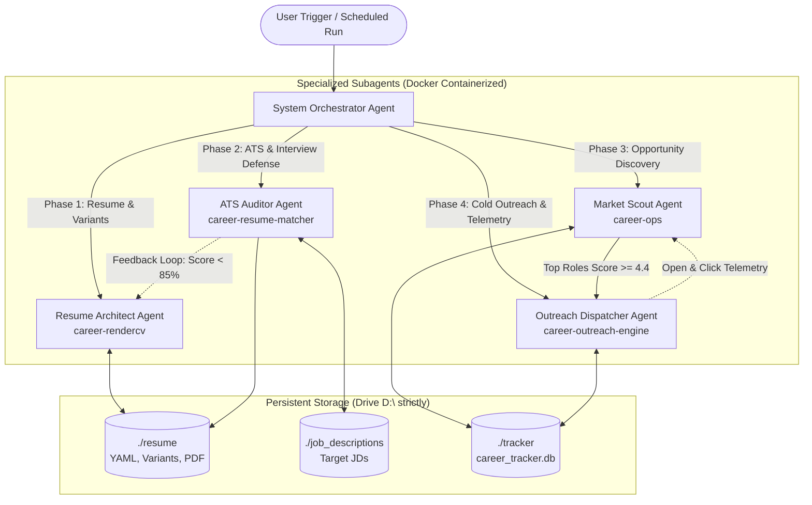

# End-to-End High-Paying SWE Career System

A containerized, metric-driven multi-agent career automation ecosystem designed to land Tier-1 and high-compensation ($130k–$350k+) Software Engineering roles.

Built with strict Docker container isolation, local-first persistent storage, and zero paid third-party dependencies.

---

## 🚀 60-Second Plug & Play Quickstart

Anyone can clone and run this entire career system instantly — **zero host dependencies, no manual setup, and 100% free-tier offline-compatible**:

### Option A: Interactive Setup Wizard (Recommended)
```powershell
# Windows PowerShell
.\setup.ps1

# macOS / Linux / WSL
chmod +x setup.sh && ./setup.sh
```
*Prompts for your name and role, personalizes your local resume template, and launches the autopilot.*

### Option B: 1-Click Autopilot Runner
```powershell
# Windows PowerShell
.\run_pipeline.ps1

# macOS / Linux / WSL
chmod +x run_pipeline.sh && ./run_pipeline.sh
```
*Auto-bootstraps `.env` and `master_resume.yaml` if missing, compiles your vector ATS PDF resume, audits ATS compatibility, scans high-paying jobs ($170k–$370k+), drafts personalized cold emails & form answers, and launches the live telemetry daemon on port 8085.*

### Option C: Pure Docker Compose
```bash
docker compose up
```

---

## 🏗️ 5-Subagent Architecture



---

## ⚡ Specialized Subagent Services

### 1. `resume-architect` (`services/rendercv`)
- **Engine:** RenderCV + Typst / LaTeX vector compilation engine.
- **Theme:** Jake's Resume Classic (`sb2nov`) with 1.2cm margins, single-column layout, and exact 2-page budget (zero orphan headers).
- **Metric Formulation:** Enforces the **Google X-Y-Z Formula** (*Accomplished [X], as measured by [Y], by doing [Z]*) across every experience bullet.
- **Outputs:** High-res vector ATS PDF (`candidate_cv.pdf`) and preview PNGs.

### 2. `ats-auditor` (`services/resume-matcher`)
- **Engine:** Semantic gap analyzer powered by free-tier Google Gemini (`gemini-3.8-flash`) or local Ollama (`llama3.2`).
- **ATS Bar-Raiser:** Evaluates hard keyword coverage, systems engineering taxonomy, and metric density against target high-comp JDs.
- **AI-Phrase Scrubbing Refiner:** Scans bullets against upstream `AI_PHRASE_BLACKLIST` to purge LLM cliches (*"spearheaded"*, *"architected"*, *"synergy"*, *"cutting-edge"*) and suggest high-signal engineering phrasing.
- **Interview Defense Generator:** Compiles `interview_defense_prep.md` with deep-dive STAR narratives and high-probability system design defense answers (network partitions, CDC, consumer group rebalancing, exact-once semantics).

### 3. `market-scout` (`services/career-ops`)
- **Engine:** Multi-portal job discovery engine scanning Greenhouse, Ashby, and Lever public endpoints.
- **Compensation & Quality Filter:** Focuses strictly on high-compensation engineering roles ($130k–$350k+).
- **Startup Funding & Runway Radar:** Ingests venture capital rounds, capital raised, valuations, and lead investors for Tier-1 companies and startups (OpenAI, Stripe, Databricks, Ramp, Scale AI, Figma, etc.).
- **Decision-Maker Discovery:** Generates targeted search queries to identify Engineering Managers, Heads of Engineering, and Technical Recruiters.
- **Application CRM:** Manages complete recruitment lifecycle in SQLite: `IDENTIFIED` $\rightarrow$ `TAILORED` $\rightarrow$ `APPLIED` $\rightarrow$ `OUTREACH_SENT` $\rightarrow$ `INTERVIEWING` $\rightarrow$ `OFFER`.

### 4. `outreach-dispatcher` (`services/outreach-engine`)
- **Cold Email Composer:** Leverages LLM prompting to craft 3-paragraph executive cold emails referencing target engineering scale and candidate's quantifiable achievements.
- **Application Form Auto-Answers:** Generates pre-written, truthful answers to common application portal questions (Greenhouse/Lever/Ashby) for fast copy-pasting during applications.
- **Open & Click Telemetry Server:**
  - 1x1 transparent GIF tracking pixel: `GET /t/o/{tracking_id}`
  - Redirect click tracker: `GET /t/c/{tracking_id}?url=...`
  - Real-time analytics API: `GET /api/stats` (open rate, click rate, reply rate).
- **LinkedIn Outreach Sequencing:** Generates punchy 280-character connection request notes.
- **Follow-up Cadence:** 3-stage reminder cadence (Day 3 check-in, Day 7 value-add architecture insight, Day 14 closeout).

### 5. `system-orchestrator` (`AGENTS.md`)
- Coordinates pipeline sequencing, enforces container isolation, validates persistent volume mounts, and handles feedback loops between auditing and resume tailoring.

---

## 🚀 Quickstart & Setup

### Prerequisites
- [Docker Desktop](https://www.docker.com/products/docker-desktop/) with Docker Compose support.
- Windows host: Repository configured on persistent drive `D:\` (`D:\Projects\career-system`).

### 1. Environment Configuration
Copy the template and configure your keys:
```bash
cp .env.example .env
```
Edit `.env`:
```ini
# Free-Tier LLM Backend
GEMINI_API_KEY=your_free_gemini_api_key
GEMINI_MODEL=gemini-3.8-flash

# Local Ollama Fallback (Zero-cost local)
OLLAMA_BASE_URL=http://ollama:11434
OLLAMA_MODEL=llama3.2

# Market Filters
MIN_BASE_SALARY=100000
TARGET_MAX_SALARY=1000000

# Email Delivery (Native SMTP via Gmail App Password)
SMTP_HOST=smtp.gmail.com
SMTP_PORT=587
SMTP_USER=your_email@gmail.com
SMTP_PASS=your_gmail_app_password
TRACKING_BASE_URL=http://localhost:8085
```

---

## ⚡ One-Click Autonomous Execution (Autopilot)

Run the full end-to-end pipeline (Resume compile -> ATS audit -> Job scrape -> Cold emails -> Form answers -> Telemetry daemon) with a single command:

```powershell
# Windows
.\run_pipeline.ps1

# Linux / macOS / WSL
chmod +x run_pipeline.sh
./run_pipeline.sh
```

👉 **For complete hands-free daily scheduling instructions (e.g. 9:00 AM daily task), see the [Zero-Touch User Guide (USER_GUIDE.md)](USER_GUIDE.md).**

---

## 📋 Granular Subagent Command Playbook

```powershell
# ==========================================================
# 1. COMPILE MASTER RESUME (Vector PDF & PNGs)
# ==========================================================
docker compose run --rm rendercv render master_resume.yaml

# ==========================================================
# 2. RUN ATS AUDIT, AI REFINER & INTERVIEW DEFENSE PREP
# ==========================================================
docker compose run --rm resume-matcher

# ==========================================================
# 3. SCAN HIGH-COMP JOBS & FUNDING RADAR
# ==========================================================
docker compose run --rm career-ops

# ==========================================================
# 4. GENERATE COLD OUTREACH, LINKEDIN NOTES & FORM ANSWERS
# ==========================================================
docker compose run --rm outreach-engine

# ==========================================================
# 5. START TELEMETRY TRACKING SERVER (Background Daemon)
# ==========================================================
docker compose up -d outreach-engine
curl http://localhost:8085/api/stats
```

---

## 🏛️ Upstream Open-Source Foundations

This ecosystem draws inspiration and architectural patterns from top open-source projects:

| Upstream Engine | Focus Domain |
| :--- | :--- |
| [`rendercv/rendercv`](https://github.com/rendercv/rendercv) | Typst/LaTeX vector engine & schema-validated templates |
| [`srbhr/Resume-Matcher`](https://github.com/srbhr/Resume-Matcher) | ATS vector keyword extraction, NLP semantic matching & AI phrase refiners |
| [`santifer/career-ops`](https://github.com/santifer/career-ops) | Application question auto-answers, job scraping & company funding radar |

---

## 🔒 Security & Privacy

- All sensitive variables, API keys, and email passwords reside strictly in `.env` (gitignored).
- Zero paid API dependencies.
- Tracking telemetry runs strictly on local port `8085` or your self-hosted proxy.
