# Automated SWE Career System — Zero-Touch User Guide

> **Goal:** Run the entire high-paying Software Engineering career pipeline completely on autopilot—from job discovery and resume rendering to cold outreach, application form answers, and telemetry tracking—without requiring manual intervention.

---

## 📋 Table of Contents
1. [System Architecture Flow](#1-system-architecture-flow)
2. [One-Time 3-Minute Initial Setup](#2-one-time-3-minute-initial-setup)
3. [One-Click Autonomous Execution](#3-one-click-autonomous-execution)
4. [Setting Up 100% Hands-Free Daily Automation](#4-setting-up-100-hands-free-daily-automation)
   - [Windows Task Scheduler (Every Morning at 9:00 AM)](#a-windows-task-scheduler-recommended-for-windows)
   - [Linux / WSL / macOS (Cron Job)](#b-linux--wsl--macos-cron-job)
5. [What Runs Under the Hood (Step-by-Step)](#5-what-runs-under-the-hood-step-by-step)
6. [Accessing Generated Outputs & Reports](#6-accessing-generated-outputs--reports)
7. [Live Telemetry & Tracking Dashboard](#7-live-telemetry--tracking-dashboard)
8. [Production Safeguards & Anti-Spam Rules](#8-production-safeguards--anti-spam-rules)
9. [Troubleshooting & Maintenance](#9-troubleshooting--maintenance)

---

## 1. System Architecture Flow

Every day the automated pipeline runs through 5 autonomous phases inside isolated Docker containers:

```mermaid
graph TD
    Trigger([Autopilot Trigger<br/>Cron / Task Scheduler / Manual]) --> Runner[run_pipeline.ps1 / run_pipeline.sh]

    subgraph "Phase 1: Resume Engineering"
        Runner --> R1[career-rendercv]
        R1 --> R2[Compiles 2-Page Vector PDF<br/>Jake's sb2nov LaTeX Theme]
    end

    subgraph "Phase 2: ATS & Style Bar-Raising"
        Runner --> M1[career-resume-matcher]
        M1 --> M2[Calculates Keyword Fit]
        M1 --> M3[Purges AI Buzzwords via Blacklist]
        M1 --> M4[Generates STAR Interview Defense Cheat-Sheet]
    end

    subgraph "Phase 3: High-Comp Opportunity Radar"
        Runner --> S1[career-ops]
        S1 --> S2[Scrapes Greenhouse, Ashby & Lever APIs]
        S1 --> S3[Filters Comp >= $130k-$350k+]
        S1 --> S4[Cross-References Startup Funding Radar]
        S1 --> S5[Updates career_tracker.db CRM]
    end

    subgraph "Phase 4: Cold Outreach & Form Answers"
        Runner --> O1[career-outreach-engine]
        O1 --> O2[Drafts 3-Paragraph Executive Cold Emails]
        O1 --> O3[Drafts 280-char LinkedIn Connection Notes]
        O1 --> O4[Auto-Answers Greenhouse/Ashby Custom Questions]
        O1 --> O5[Schedules Day 3, 7, 14 Follow-ups]
    end

    subgraph "Phase 5: Live Funnel Telemetry"
        Runner --> T1[FastAPI Server on Port 8085]
        T1 --> T2[Logs 1x1 Pixel Email Opens]
        T1 --> T3[Logs Portfolio / GitHub Link Clicks]
    end
```



---

## 2. 60-Second Plug & Play Setup

All dependencies run inside isolated Docker containers, meaning **zero software needs to be installed on your Windows/Mac host** except Docker Desktop.

### Option A: Interactive Setup Wizard (Fastest)

Run the interactive setup wizard to configure your profile and environment in 30 seconds:

```powershell
# Windows PowerShell
.\setup.ps1

# macOS / Linux / WSL
chmod +x setup.sh && ./setup.sh
```

The wizard will:
1. Initialize `.env` from `.env.example`
2. Initialize `resume/master_resume.yaml` from template
3. Prompt for your Name, Target Title, and optional Gemini API Key
4. Offer to immediately trigger the full autonomous pipeline

---

### Option B: Manual Configuration

If you prefer to configure manually:

1. **Start Docker Desktop**: Ensure Docker Desktop is running in the background.
2. **Copy Environment Template**:
   ```powershell
   Copy-Item .env.example .env
   ```
3. **Configure Keys** in `.env`:
   ```ini
   # Free-Tier LLM Backend (Get a free key at https://aistudio.google.com/)
   GEMINI_API_KEY=your_free_gemini_api_key
   GEMINI_MODEL=gemini-3.8-flash

   # Market-Scout High-Comp Filtering
   MIN_BASE_SALARY=130000
   TARGET_MAX_SALARY=350000

   # Optional: Email Delivery (Free Gmail App Password)
   # If left blank, Outreach Engine automatically runs in safe DRY_RUN mode.
   SMTP_HOST=smtp.gmail.com
   SMTP_PORT=587
   SMTP_USER=your_email@gmail.com
   SMTP_PASS=your_gmail_app_password
   TRACKING_BASE_URL=http://localhost:8085
   ```
4. **Initialize Your Resume Data**:
   ```powershell
   Copy-Item resume/master_resume.example.yaml resume/master_resume.yaml
   ```
   *(Your personal `master_resume.yaml` is automatically gitignored so your personal information remains strictly on your local disk.)*

---

## 3. One-Click Autonomous Execution

To trigger the entire end-to-end pipeline on demand with a single command:

### On Windows:
```powershell
.\run_pipeline.ps1
```

### On Linux / macOS / WSL:
```bash
chmod +x run_pipeline.sh
./run_pipeline.sh
```

### Execution Flags:
- `.\run_pipeline.ps1 -DryRun`: Generates all cold emails and sequences without sending live emails.
- `.\run_pipeline.ps1 -ServeOnly`: Starts or restarts the telemetry server on port 8085.
- `.\run_pipeline.ps1 -SkipScrape`: Skips scraping online job boards and uses the existing database cache.

---

## 4. Setting Up 100% Hands-Free Daily Automation

To make the career system run every weekday morning (e.g., at 9:00 AM) while you sleep or grab coffee:

### A. Windows Task Scheduler (Recommended for Windows)

Run this one-liner in an **Administrator PowerShell** window to register an automated daily task:

```powershell
$Action = New-ScheduledTaskAction -Execute "PowerShell.exe" -Argument "-NoProfile -ExecutionPolicy Bypass -File D:\Projects\career-system\run_pipeline.ps1"
$Trigger = New-ScheduledTaskTrigger -Daily -At 9:00AM
$Settings = New-ScheduledTaskSettingsSet -AllowStartIfOnBatteries -DontStopIfGoingOnBatteries -StartWhenAvailable
Register-ScheduledTask -TaskName "DailySWEPipeline" -Action $Action -Trigger $Trigger -Settings $Settings -Description "Runs the automated SWE Career Pipeline daily at 9 AM"
```

To verify the task was created:
```powershell
Get-ScheduledTask -TaskName "DailySWEPipeline"
```

To run the scheduled task immediately for testing:
```powershell
Start-ScheduledTask -TaskName "DailySWEPipeline"
```

---

### B. Linux / WSL / macOS (Cron Job)

Open your crontab editor:
```bash
crontab -e
```
Add the following line to execute every weekday at 9:00 AM:
```cron
0 9 * * 1-5 /bin/bash /path/to/career-system/run_pipeline.sh >> /path/to/career-system/tracker/pipeline.log 2>&1
```

---

## 5. What Runs Under the Hood (Step-by-Step)

When triggered, the autonomous runner coordinates all 5 phases sequentially:

| Step | Container | What Happens Automatically |
| :--- | :--- | :--- |
| **1. Resume Vector Render** | `career-rendercv` | Reads `master_resume.yaml`, validates schema, checks margins, and compiles an exact 2-page ATS vector PDF using Jake's `sb2nov` LaTeX theme. |
| **2. ATS & AI-Phrase Audit** | `career-resume-matcher` | Evaluates your resume against Senior Distributed Systems, Full-Stack, and Platform JDs. Checks keyword overlap, tests against the Google X-Y-Z formula, flags banned AI buzzwords (*"spearheaded"*, *"architected"*, *"synergy"*), and outputs a STAR interview defense cheat-sheet. |
| **3. Market Scraping & Funding** | `career-ops` | Scrapes public Greenhouse, Ashby, and Lever APIs across Tier-1 tech (Stripe, Databricks, OpenAI, Scale AI, Ramp, etc.). Filters by title, compensation ($\ge \$130\text{k}$), cross-checks recent Series A/B/C venture capital funding data, and updates SQLite. |
| **4. Outreach & Form Answers** | `career-outreach-engine` | Takes the top-ranked opportunities ($\text{score} \ge 4.4$), drafts 3-paragraph executive cold emails, generates 280-char LinkedIn connection request notes, prepares application question answers, and records follow-up cadences. |
| **5. Telemetry Tracking Server** | `career-outreach-engine` | Ensures the FastAPI server is running as a daemon on port `8085` to capture tracking pixel opens and link click redirects. |

---

## 6. Accessing Generated Outputs & Reports

All reports are generated automatically in clean, readable Markdown on your local drive:

| Generated Report | File Location | Purpose & Contents |
| :--- | :--- | :--- |
| 📄 **Master Resume (PDF)** | `resume/rendercv_output/candidate_cv.pdf` | Vector ATS-optimized resume ready to submit. |
| 🔍 **ATS Compatibility Audit** | `resume/reports/ats_audit_report.md` | Numerical match score, missing keywords, and AI buzzword audit. |
| 🛡️ **Technical Interview Defense** | `resume/reports/interview_defense_prep.md` | Deep-dive STAR narratives and system design failure recovery defense answers. |
| 🏆 **Top Opportunities Leaderboard** | `tracker/reports/top_opportunities.md` | Ranked high-paying engineering roles with compensation and startup funding badges. |
| ✉️ **Cold Outreach Sequences** | `tracker/reports/outreach_pipeline.md` | Personalized executive cold emails, tracking IDs, and LinkedIn connection notes. |
| 📝 **Application Form Answers** | `tracker/reports/application_answers.md` | Pre-written, truthful answers to custom Greenhouse/Ashby/Lever application fields. |

---

## 7. Live Telemetry & Tracking Dashboard

The background telemetry server continuously monitors recruiter interactions:

### Check Funnel Telemetry in Terminal:
```powershell
Invoke-RestMethod -Uri "http://localhost:8085/api/stats"
```
**Sample JSON Response:**
```json
{
  "total_outreach": 5,
  "opened": 2,
  "clicked": 1,
  "replied": 0,
  "open_rate": "40.0%",
  "click_rate": "20.0%",
  "reply_rate": "0.0%"
}
```

### Health Check Endpoint:
```powershell
Invoke-RestMethod -Uri "http://localhost:8085/health"
```

### How Tracking Works:
1. **Email Open Detection:** Injects an invisible 1x1 GIF tracking pixel (`/t/o/{tracking_id}`). When a recruiter opens your email, the server records the timestamp, open count, and device/user agent.
2. **Link Click Redirects:** Wraps your portfolio and GitHub links (`/t/c/{tracking_id}?url=...`). When clicked, the server records the click count and redirects seamlessly to your real URL.

---

## 8. Production Safeguards & Anti-Spam Rules

1. **Host Isolation:** Zero host dependencies. All compilation, scraping, database transactions, and email processing run inside Docker containers.
2. **Strict Daily Volume Caps:** Outreach is capped at a maximum of 15 contacts per day to protect your domain reputation.
3. **Dry-Run Safety Mode:** If SMTP credentials are empty or omitted in `.env`, the system automatically runs in dry-run mode, drafting all emails and notes to Markdown without sending live emails.
4. **Source-of-Truth Boundary:** The system never hallucinates claims. All bullets and form answers draw strictly from verified achievements in your local resume.
5. **Anti-AI Detection:** The built-in AI phrase refiner scrubs generic LLM clichés and enforces concrete engineering metrics.

---

## 9. Troubleshooting & Maintenance

### "Docker daemon is not running"
- **Cause:** Docker Desktop is not started.
- **Fix:** Launch Docker Desktop from the Start menu and wait for the status indicator to turn green.

### "Gemini API Warning: Status 429 / Quota Exceeded"
- **Cause:** Free-tier Gemini API keys allow 15–20 requests/minute.
- **Fix:** The system automatically falls back to deterministic high-quality templates and proceeds without crashing. Your reports will still be generated.

### "SMTP Authentication Failed"
- **Cause:** Incorrect Gmail App Password.
- **Fix:** Generate a 16-character App Password at [Google Account > Security > App Passwords](https://myaccount.google.com/apppasswords) and paste it into `SMTP_PASS=` in `.env`.

### Clearing Stale Docker Containers
To clean up dangling test containers and rebuild fresh images:
```powershell
docker compose down
docker system prune -f
docker compose build
```

---

*System engineered for high-signal, zero-downtime, fully automated career advancement.*
